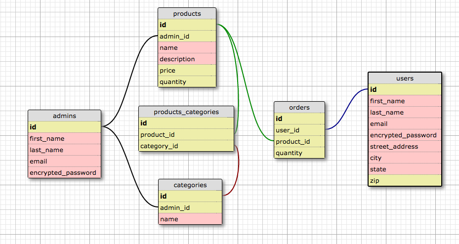

# App Name here

## User Stories
*As a user...
    *I want a pleasant and intuitive experience while browsing products
    *I want to see a full listing of all products
    *I want to see details of each individual product
    *I want to be able to use a purchase form to buy a product
    *I want to be able to add items to a cart
    *I want to be able to check out items from my cart
    *I want to be able to view my purchase history

*As an admin...
    *I want full CRUD functionality for each product
    *I want a simple tabular index to view products
    *I want authentication to restrict privileges
    *I want products to be associated with categories

## Schema screenshot

-

## Installation Notes

- Ruby 2.2.5
- Rails 4.2.5
- Database: PostgreSQL
- Devise

## Deployment details and link

- [App Name Link](https://fathomless-chamber-75179.herokuapp.com/users/sign_in)
